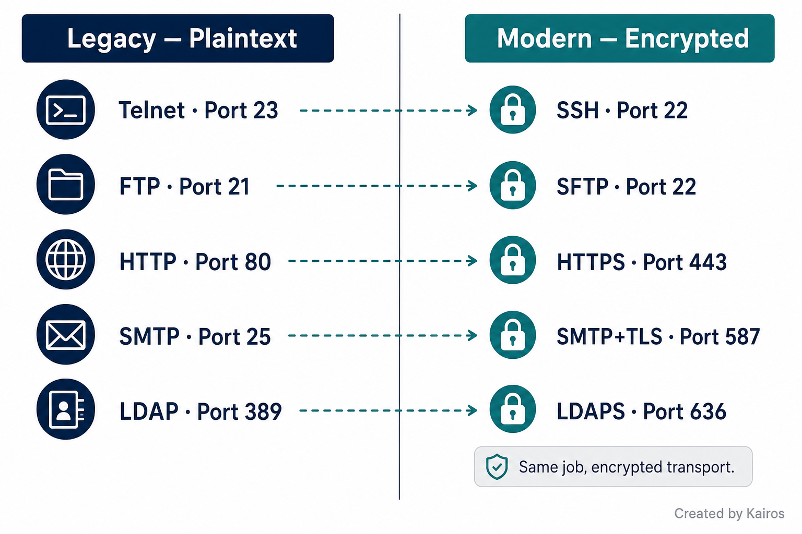
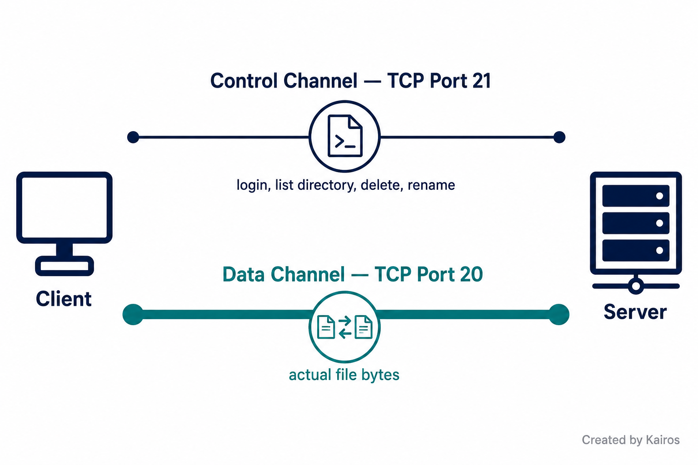
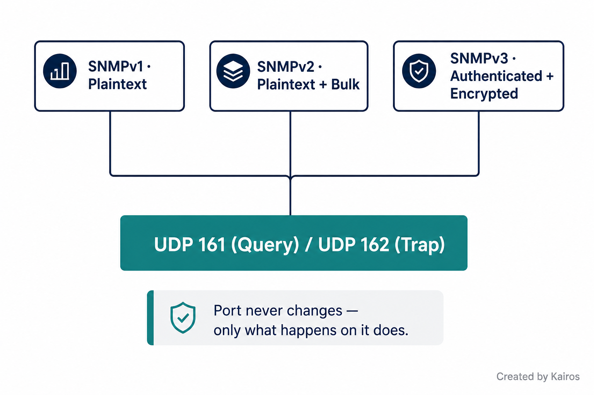

# Common Ports
*The well-known port numbers every networking professional is expected to know cold — and the protocol behavior behind each one*

## In short
Every application on a network needs a fixed "door number" so traffic knows exactly where to go once it reaches a device. These are well-known ports — TCP or UDP, 0–1023, standardized across the industry. The port number itself isn't just trivia to memorize; it usually tells you something about the protocol's design trade-offs — whether it needs reliability or speed, whether it's encrypted, and why.

## What it is
A well-known port is a fixed, agreed-upon number that a specific service always listens on by default — port 80 always means "probably HTTP," port 443 always means "probably HTTPS," and so on. This is what lets a client connect to a server without needing to ask "which port are you using?" first.

Most of these protocols come in pairs: an old, insecure version and a newer, encrypted replacement — FTP → SFTP, Telnet → SSH, HTTP → HTTPS, SMTP (port 25) → SMTP with TLS (port 587), SNMP v1/v2 → SNMPv3, LDAP → LDAPS. Spotting that pattern is more useful for the exam than memorizing each pair in isolation.

## Quick reference

| Protocol | Port(s) | Transport | Purpose |
|---|---|---|---|
| FTP (data) | 20 | TCP | File transfer — actual file bytes |
| FTP (control) | 21 | TCP | File transfer — commands/auth |
| SSH | 22 | TCP | Encrypted remote terminal |
| SFTP | 22 | TCP | Encrypted file transfer (runs over SSH) |
| Telnet | 23 | TCP | Unencrypted remote terminal (legacy) |
| SMTP | 25 | TCP | Server-to-server email relay, plaintext |
| DNS | 53 | UDP (query) / TCP (zone transfer, large responses) | Name ↔ IP resolution |
| DHCP (server) | 67 | UDP | Automatic IP assignment |
| DHCP (client) | 68 | UDP | Automatic IP assignment |
| TFTP | 69 | UDP | Simple, auth-less file transfer |
| HTTP | 80 | TCP | Web traffic, plaintext |
| NTP | 123 | UDP | Clock synchronization |
| SNMP (query) | 161 | UDP | Device monitoring/management |
| SNMP (trap) | 162 | UDP | Device-initiated alert to management station |
| LDAP | 389 | TCP | Directory service queries |
| HTTPS | 443 | TCP | Web traffic, encrypted (SSL/TLS) |
| SMTP (TLS) | 587 | TCP | Client-to-server mail submission, encrypted |
| LDAPS | 636 | TCP | Directory service queries, encrypted |
| SMB | 445 | TCP | Windows file/printer sharing, auth |
| Syslog | 514 | UDP | Centralized log transport |
| MS-SQL | 1433 | TCP | Microsoft SQL Server database |
| RDP | 3389 | TCP | Full remote desktop (GUI) |
| SIP | 5060 / 5061 | TCP | VoIP call setup/teardown |

## Why it matters
This is the stuff that actually shows up as a scenario question, not just "what port is X" in isolation.

→ A lot of these protocols exist in **insecure/secure pairs on different ports** (HTTP 80 → HTTPS 443, Telnet 23 → SSH 22, SMTP 25 → SMTP-TLS 587, LDAP 389 → LDAPS 636). But that pattern doesn't hold everywhere — **SNMP is the trap**. All three SNMP versions (v1, v2, v3) use the *same* ports, 161 and 162. The security upgrade in v3 (authentication + encryption) happens *within* the same port, not by moving to a new one. Assuming "more secure = different port" as a universal rule is exactly the kind of thing that gets exam-trapped.

→ SFTP isn't a separate protocol that happens to share port 22 with SSH — it **is** SSH, tunneling file transfer through the same encrypted connection. That's why they share a port: same underlying mechanism, different use case.

→ Port 587 is easy to get backwards under pressure. **25 = server-to-server relay. 587 = client submitting mail to its own server**, with TLS. The encryption is the actual design goal; the fact that 587 also dodges a lot of ISP anti-spam blocking on port 25 is a side effect, not the reason it exists.

→ TFTP (UDP 69) trades away everything FTP has — auth, directory browsing, file management — in exchange for speed and zero overhead. This is *why* it's the go-to for something like a VoIP phone with no config yet, pulling one file automatically right after boot.

→ DNS normally uses UDP 53 for quick queries, but switches to **TCP 53** — same port number, different transport — for zone transfers between DNS servers or responses too large for a single UDP datagram. Not a different port, just a different reliability requirement.

→ Syslog (UDP 514) intentionally accepts occasional message loss. At the scale of hundreds or thousands of devices constantly logging, TCP's per-message overhead isn't worth it — you're pattern-hunting across huge volumes in a SIEM, not depending on any single log line arriving.

→ LDAP carries directory data — usernames, org structure, device names, and sometimes credentials during an authentication bind. It does **not** carry files or documents; that's outside its scope. Plaintext LDAP is risky mainly for credential exposure and reconnaissance (an attacker learns your whole org chart), not "document theft."

→ RDP (3389) and SSH (22) both give remote access but solve different problems: SSH is command-line only, RDP hands you the full GUI desktop. RDP-the-service is a Windows thing, but RDP *clients* exist for Mac, Linux, iOS, Android — so the direction of connection usually runs toward a Windows machine, not the other way around.

## How it works

### File transfer protocols

FTP splits control and data across two ports: **21** for commands (login, list directory, delete/rename), **20** for the actual file bytes. Fully plaintext. SFTP does the same file management job but wrapped inside SSH's encrypted tunnel — port **22**, same as SSH itself. TFTP strips everything down to "send me this one file, no login, no browsing" — port **69**, over UDP, built for speed and automation rather than features.

### Remote access protocols
SSH (**22**) gives an encrypted command-line session to a remote device — every keystroke, including credentials, is encrypted. Telnet (**23**) does the identical job with zero encryption, which is why it's effectively dead on real networks — anyone capturing the traffic reads your login in plaintext. RDP (**3389**) is a different category entirely: full graphical desktop access, not just a terminal.

### Email protocols
SMTP (**25**) moves mail server-to-server, plaintext by default. SMTP with TLS (**587**) is the client-facing version — your mail app submitting a message to your outgoing mail server, encrypted and authenticated.

### Name resolution and addressing
DNS (**53**, UDP normally, TCP for zone transfers/large responses) resolves domain names to IP addresses. DHCP (**67** server-side, **68** client-side, both UDP) automatically hands out IP addresses on a lease, optionally reserving a fixed IP per MAC address.

### Web traffic
HTTP (**80**) is plaintext. HTTPS (**443**) adds SSL/TLS encryption — the default for the large majority of real-world web traffic today.

### Network management and time

NTP (**123**, UDP) keeps device clocks synchronized — critical for correlating logs across many devices during an investigation, since even sub-second drift makes timeline reconstruction unreliable. SNMP (**161** for queries, **162** for device-initiated traps, both UDP) monitors device health. v1 and v2 are plaintext; v2 adds bulk queries over v1's one-at-a-time model; v3 adds authentication and encryption — all on the same two ports across every version.

### Directory services and Windows sharing
LDAP (**389**) queries a hierarchical directory: organization → organizational units → individual objects (users, devices). LDAPS (**636**) is the encrypted version. SMB (**445**) handles Windows file sharing, printer sharing, and authentication, built directly into Explorer — legacy versions ran over NetBIOS before Windows moved this directly onto IP. Also referred to as CIFS.

### Logging, databases, VoIP
Syslog (**514**, UDP) centralizes log messages from routers, switches, firewalls, and servers into a SIEM for correlation and search. MS-SQL (**1433**, TCP) is Microsoft's database protocol. SIP (**5060/5061**, TCP) handles VoIP call setup and teardown, and extends to video conferencing, IM, and file transfer over the same session control.

## Key details to remember
- FTP = two ports (20 data, 21 control). Everything else on this list is a single port.
- SFTP shares SSH's port (22) because it *is* SSH — not a coincidence, not a separate protocol.
- SNMP is the same ports across all versions (161/162) — the security upgrade in v3 happens within the port, not by changing it. Don't assume "secure version = new port" universally.
- Port 587 = client → server (TLS). Port 25 = server → server (plaintext). Easy to flip under pressure — double-check before answering.
- TFTP (UDP 69) has no auth and no file management — just raw, fast single-file transfer.
- DNS TCP-53 isn't a different number from UDP-53 — same port, different transport, triggered by zone transfers or oversized responses.
- LDAP carries directory/identity data and sometimes credentials during a bind — not documents or files.
- Syslog accepts message loss by design (UDP) — the trade-off is scale and speed over per-message guarantee.
- RDP = full GUI. SSH = command line only. Different category of remote access, not just "more features."

## Where I got confused
- Flipped SMTP ports mid-session — got 587 = client/TLS correct once, then a few questions later stated 587 as "direct server to server," which is port 25's job, not 587's.
- On the SNMP trap question, assumed v3 uses a different port than v1/v2 "because it's secure" — all three versions use 161/162; only the in-band security model changes.
- Framed LDAP's risk as exposing "any document or anything" — LDAP is a directory service, not file storage; the actual risk is credential exposure during binds and org-structure reconnaissance.
- Rapid-fire recall dropped off sharply after the first ~7 ports (FTP/SSH/SFTP/Telnet/SMTP family) — Telnet answered as port "497" and TFTP as "61" instead of 23 and 69, and NTP/SNMP/LDAP/LDAPS/SMB/Syslog/MS-SQL/SIP all came back blank. Pattern: strong on the ports drilled earliest and most repeated, weak on ports covered later in the same session — a repetition problem, not a comprehension one.
- Wrote DNS's zone-transfer port as "TCP 531" — a transposition of the correct number (53), not a different port needing a different fact.

## How I'd say this out loud
Most of these ports come in pairs — an old insecure version and a newer encrypted one — so if I can remember *why* the secure version needed a change, the port number usually follows. FTP's plaintext, so SFTP rides on SSH's encrypted connection instead of inventing something new — that's why they share port 22. Telnet's plaintext, so SSH replaced it outright on port 22 as well. HTTP versus HTTPS is the cleanest example: 80 open, 443 wrapped in TLS. SMTP is where it gets tricky — 25 is server-to-server and stays plaintext, but 587 is specifically for a client submitting mail with TLS, and that direction is easy to mix up if I don't slow down. SNMP is the one exception to the whole "secure version, new port" pattern — v3 is more secure than v1 or v2, but it's still sitting on 161 and 162, it just adds encryption on top instead of moving anywhere. TFTP's the odd one out entirely — no auth, no browsing, just grab one file fast on port 69, which is exactly what a VoIP phone needs the second it boots with no config at all.
