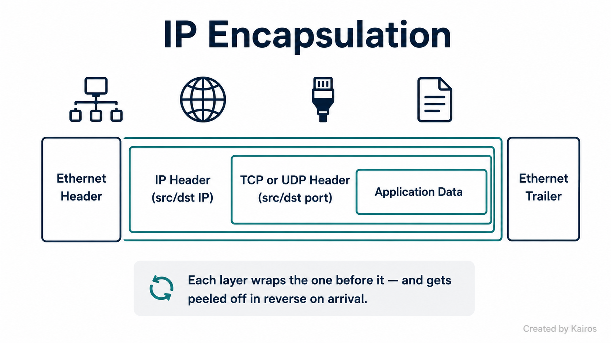
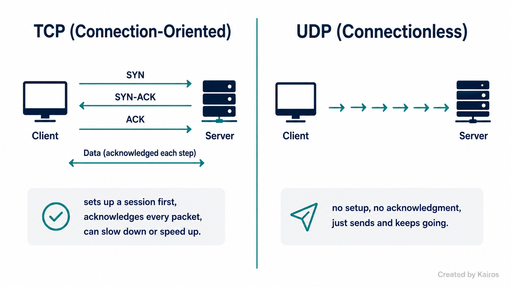
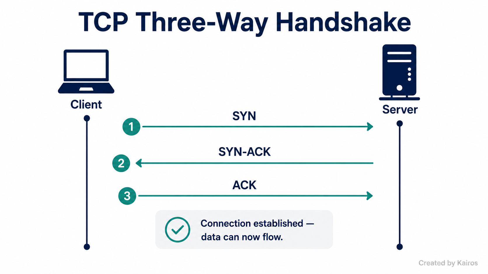
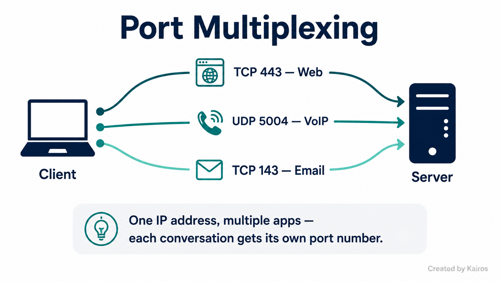

# Introduction to IP
*How data actually gets from one device to another — encapsulation, TCP vs UDP, and ports*

## In short
IP is the thing that gets data from one device to another across a network. It doesn't do this alone — data gets wrapped in layers on the way out (encapsulation) and unwrapped in the same order on the way in. TCP and UDP sit one layer above IP and decide *how* that data gets delivered — reliably with acknowledgment, or fast with no guarantees. Ports are what let multiple applications share the same IP address at the same time.

## What it is
Think of it like moving house. The network (Ethernet, WiFi, whatever) is the road. IP is the moving truck driving on that road. TCP or UDP are the boxes loaded onto the truck. The application data (HTTP, email, etc.) is what's actually inside each box. The destination IP is the house address, and the port number is which room in the house the box goes to.

This wrapping process — data going into a box, the box going onto a truck, the truck going onto the road — is **encapsulation**. Every layer adds its own header (and Ethernet adds a trailer too) around what the layer above it handed down.

## Quick reference

| Concept | Layer | Core thing |
|---|---|---|
| IP | 3 | Gets the packet to the right *device* via destination IP |
| TCP | 4 | Connection-oriented, reliable, has flow control |
| UDP | 4 | Connectionless, no reliability, no flow control |
| Port | 4 | Identifies which *application* on the device gets the data |
| Well-known port | — | Fixed, server-side, range 0–1023 |
| Ephemeral port | — | Temporary, client-side, range 1024–65535 |
| Socket | — | Protocol + IP + port — uniquely identifies one conversation |
| Three-way handshake | — | SYN / SYN-ACK / ACK — sets up a TCP session before data moves |
| Flow control | — | Receiver tells sender to speed up or slow down (TCP only) |
| Head-of-line blocking | — | TCP holds later packets back in the buffer while waiting on a lost one |

## Why it matters
This is the stuff that actually gets tested with a packet capture in front of you, not just asked as a definition.

→ Frame ≠ packet. A **frame** is the whole thing (Ethernet header + IP packet + Ethernet trailer). A **packet** is what's inside (IP header + payload). Mixing these up in an interview is an instant tell.

→ UDP dropping under load isn't random — it's expected, because UDP has no **flow control**. TCP's ongoing conversation lets the receiver tell the sender to back off before things get overwhelmed; UDP has no such conversation at all.

→ TCP and UDP *can* both use the same port number (e.g. TCP 8443 and UDP 8443) with zero conflict, because protocol is part of the socket tuple. What's actually restricted is two services on the *same protocol* trying to listen on the same port.

→ A port number alone can't route anything across the internet — routers only look at the destination IP. The port only gets read *after* the packet has already reached the right device.

→ Blocking a port at the firewall (e.g. "block 443 outbound") isn't bulletproof — port numbers are convention, not enforcement. Nothing stops an app from just using a different port.

## How it works

### Encapsulation — outside to inside
Order of headers in a captured frame: **Ethernet header → IP header (source/destination IP) → TCP or UDP header (source/destination port) → application data → Ethernet trailer.**

→ Each layer only cares about its own header. Ethernet moves the frame across the local link, IP gets the packet to the right device, TCP/UDP gets the data to the right app on that device.

### TCP — connection-oriented, reliable
→ Starts every session with a **three-way handshake**: SYN, SYN-ACK, ACK. This is what makes TCP connection-oriented — a formal setup before any data moves, and a formal teardown when it's done. This is a separate mechanism from reliability, not the same thing.

→ **Reliability** comes from acknowledging every packet received. If an ack doesn't come back in time, the sender retransmits. Packets are numbered, so the receiver can request specifically what's missing instead of the whole thing being resent.

→ **Flow control** comes from that same ongoing back-and-forth — the receiver can tell the sender to speed up or slow down.

→ The cost of all this is **head-of-line blocking**: if a packet is lost, TCP holds back any packets that arrived *after* it, so they get delivered to the application in order — not immediately. The sender doesn't actually stop sending; it's the receiver withholding already-arrived data while it waits on the gap.

### UDP — connectionless, no guarantees
→ No handshake, no session setup or teardown, no acknowledgment, no flow control. Packets just get sent and handed to the application immediately as they arrive, gaps and all.

→ "Unreliable" doesn't mean worse odds of delivery — TCP and UDP have the same actual chance of a packet making it across the network. The difference is UDP gives no confirmation either way, so there's no way to know or recover.

→ This is why real-time voice/video/gaming use UDP — a late, "recovered" packet is worthless once the moment has passed. Better to drop a bad frame and keep moving than stall waiting for a retransmit.

### Ports and multiplexing

→ A port number is how one IP address supports many applications running at once — this is **multiplexing**. Well-known ports (0–1023) are the fixed, expected ports for known services (HTTP=80, HTTPS=443, SSH=22). Ephemeral ports (1024–65535) are temporary, client-side, assigned per connection.

→ The OS tracks every open connection using a **socket table**: protocol + local IP + local port + remote IP + remote port. When a reply comes in, the OS matches it against that table to hand the data to the correct app — this works even with multiple apps talking to the same server IP, because each app used a different ephemeral source port when it opened its connection.

→ This is a convention, not a hard rule — any device can technically use any port for anything. It usually holds true, but it's not enforced by the protocol.

## Key details to remember
- Frame = Ethernet header + IP packet + Ethernet trailer. Packet = IP header + payload.
- TCP = connection-oriented, reliable, has flow control. UDP = connectionless, no reliability, no flow control.
- Three-way handshake (SYN/SYN-ACK/ACK) = connection setup. Reliability (acks, retransmission) = separate mechanism, runs during data transfer.
- Head-of-line blocking = why TCP costs latency — later packets held back in-order, not the sender stopping.
- Socket = protocol + IP + port. TCP and UDP are separate namespaces, so the same port number can be used by both at once with no conflict.
- Well-known ports: 0–1023. Ephemeral ports: 1024–65535 (not 65555 — it's a 16-bit field, so 65535 is the real ceiling).
- Port numbers carry zero security weight on their own — changing a port isn't a security control, the firewall rule is.
- IP address is globally routable, gets you to the right device. Port is only locally meaningful, gets you to the right app *after* arrival.
- The OS matches incoming traffic to an app using the socket table (protocol + local/remote IP + local/remote port), relying on each app's unique ephemeral source port.
- Always cite the IP protocol field (6 = TCP, 17 = UDP) first when identifying protocol from a capture — it's direct evidence, not inference.

## Where I got confused
- Skipped the Ethernet header and trailer entirely when asked for header order, and used wrong terms — called a frame "a packet" and called the TCP/UDP header "a data packet," which isn't a real term.
- Explained UDP dropping under load using only acks/retransmission, and missed **flow control** — that's the actual mechanism that explains why TCP throttles itself and UDP doesn't.
- Thought TCP and UDP couldn't use the same port number at the same time. They can — protocol is part of the socket tuple, so TCP 8443 and UDP 8443 are two separate sockets.
- Wrote the ephemeral port range as 1024–65555 instead of 65535, and didn't flag that "high port = client" is convention, not something the protocol enforces.
- Mapped the three-way handshake to reliability/retransmission instead of connection setup — merged two separate TCP properties into one answer.
- On multiplexing, said "port and protocol help the OS classify traffic" without naming the actual mechanism — the socket table match, and the role of each app's unique ephemeral source port.
- Said TCP "stops the data flow" when a packet is lost, instead of naming **head-of-line blocking** — the sender keeps sending, it's delivery-to-application that stalls.
- Said a port "doesn't have the capability to move over network" instead of the real reason a port alone can't deliver anything — it's only locally meaningful, routers don't look at it at all.
- When identifying a protocol from a capture, led with circumstantial evidence (no handshake, missing packets) instead of the direct evidence — the IP protocol field itself (6 or 17).

## How I'd say this out loud
Getting data across a network is basically a layered wrapping process. Application data gets stuffed into a TCP or UDP box, that box gets loaded onto an IP truck, and the truck drives on whatever road — Ethernet, WiFi, doesn't matter — to the destination IP, which is the house address. Once it gets to the right house, the port number says which room the box goes to, so multiple apps can all be running on the same device at once without their data getting mixed up. TCP and UDP are just two different ways of shipping those boxes — TCP sets up a session first with a handshake, tracks every box with an acknowledgment, and can tell the sender to slow down if things are getting overwhelmed, which makes it reliable but also means it sometimes has to hold data back and wait. UDP skips all of that — no handshake, no acks, no waiting around — so it's faster but has zero guarantee anything even arrived. That's why a video call uses UDP and a file download uses TCP: one cares more about speed, the other cares more about getting every bit exactly right.
