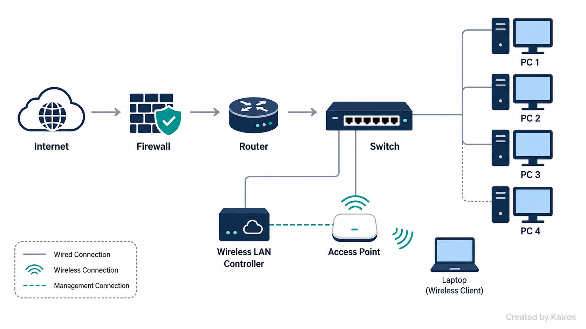
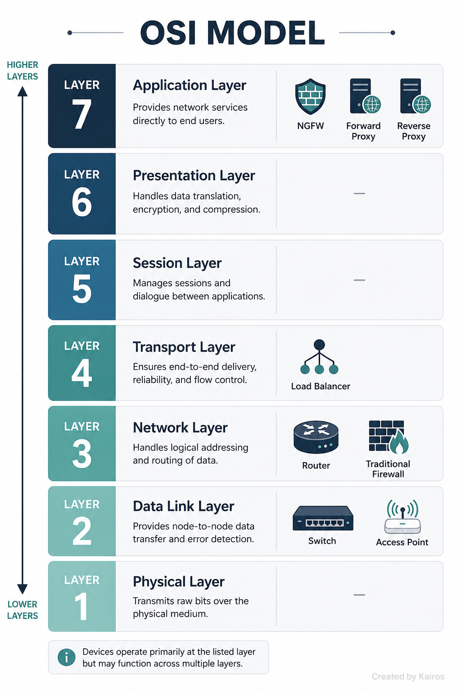
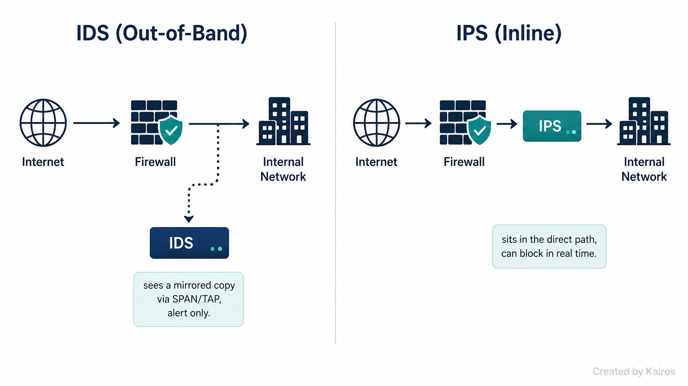
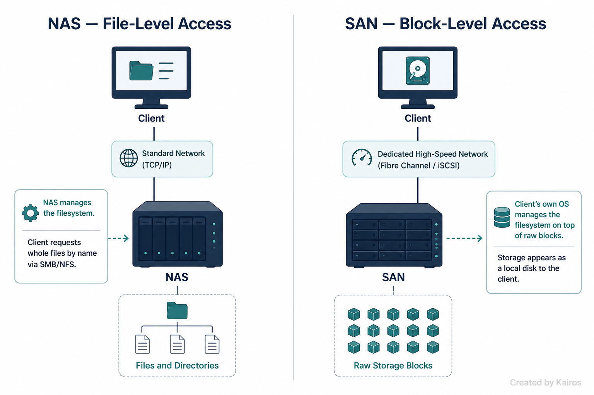

# Networking Devices
*Routers, switches, firewalls, and everything else that actually moves, filters, or stores traffic*

## In short
The hardware and software that sits between "a cable" and "a working, secure network." Every device here has one core job — most real troubleshooting and interview questions are just "given this symptom, which device is responsible, and why."

## What it is
A network isn't just wires and IP addresses — it's a stack of purpose-built devices, each doing one thing well: moving traffic locally, moving it between networks, filtering it, distributing it, watching it for attacks, or storing it. Knowing what a device does isn't enough on its own — the actual skill is knowing *why* it's classified the way it is (which OSI layer, which traffic path) and being able to reason from a symptom back to the right device.

## Quick reference

| Device | OSI Layer | Core job |
|---|---|---|
| Router | 3 | Connects *different* networks, forwards based on destination IP + routing table |
| Switch | 2 (L3 if multilayer) | Forwards frames *within* a network based on MAC address |
| Firewall (traditional) | 3 / 4 | Filters traffic by IP address and port, tracks connection state |
| NGFW | 7 | Filters by application/content — deep packet inspection (DPI) |
| IDS | Out-of-band | Watches a mirrored copy of traffic, alerts only |
| IPS | Inline | Sits directly in the traffic path, can block in real time |
| Load Balancer | 4 / 7 | Distributes traffic across multiple servers |
| Forward Proxy | 7 | Acts on behalf of the **client** |
| Reverse Proxy | 7 | Acts on behalf of the **server** |
| NAS | N/A | Shared storage, file-level access |
| SAN | N/A | Shared storage, block-level access |
| Access Point | 2 | Extends the wired network onto wireless |
| WLAN Controller | N/A | Centralized management for multiple APs |

## Why it matters
This is the vocabulary that shows up the second something breaks — "which device owns this problem" is the real question behind almost every ticket.

→ Same subnet works fine, cross-subnet doesn't? That's a **router** / default gateway problem, not a switch problem — a switch failure would break local connectivity too, not just the cross-subnet part.

→ Traffic looks fine on IP and port but still needs to be blocked? A traditional firewall can't help — that's **NGFW** territory, since it needs to inspect the actual application content.

→ An attack got flagged but wasn't stopped? Expected, if it was caught by an **IDS** — it only ever sees a mirrored copy, it was never in a position to block anything. That's what **IPS** is for.

→ Users keep getting logged out mid-session when traffic hits a different server? Check the **load balancer's** session persistence config before touching the app.

→ A database needs to feel like a local disk with high IOPS, not a network share? That's **SAN**, not NAS.

## How it works

### Router — Layer 3
Connects **different networks/subnets** together — could be two segments in the same building or two networks on opposite sides of the internet. That's the actual distinction from a switch: a switch operates *within* one network, a router connects *separate* networks.

→ Reads the **destination IP address**, checks it against its **routing table**, and forwards the packet out the correct interface toward the next hop. It doesn't "know the next hop address" directly — that's the *output* of the routing table lookup, not something it reads off the packet.

→ Devices on the same subnet never need the router — they resolve each other's MAC via ARP and talk directly at Layer 2. The router only gets involved once traffic needs to leave the local subnet, via the **default gateway**.

### Switch — Layer 2
Forwards **frames** based on **MAC address**, within a single local network.

→ Builds and maintains a **MAC address table** (CAM table) by learning the source MAC address on each port as frames arrive — that's the actual mechanism behind "forwards by MAC," not just a fact to state on its own.

→ Some switches support **PoE (Power over Ethernet)** — power and data over the same cable, useful for APs, IP phones, cameras.

→ A **Layer 3 / multilayer switch** can also route between subnets internally — it's still switching at L2 for local traffic, but has routing logic built in for L3 traffic.

→ **VLANs** split one physical switch into separate logical broadcast domains. A plain switch operating at Layer 2 has no concept of IP or routing, so even though two VLANs might share the same physical hardware, the switch alone **cannot** route traffic between them. That needs a Layer 3 device — either a router with a trunk port and sub-interfaces per VLAN (802.1Q tagging), known as **router-on-a-stick**, or a multilayer switch doing inter-VLAN routing internally.

### Firewalls — traditional vs. NGFW
Filters traffic based on a rule set — this is a **security function**, and it's the reason for its layer classification, not because it routes anything.

→ **Traditional/stateful firewall**: filters on **IP address and port number** (Layer 3/4). "Stateful" means it tracks connection state — it knows a packet belongs to an already-established session — but that's a separate capability from inspecting *content*.

→ **NGFW (Next-Generation Firewall)**: adds **Layer 7** filtering via **deep packet inspection (DPI)** — it looks inside the payload, not just the headers, so it can identify the actual application or detect malicious signatures even inside otherwise-allowed traffic.

→ Some firewalls also build **site-to-site VPNs** between each other — this is a completely separate capability from routing. A VPN tunnel **encapsulates and encrypts** traffic and sends it across a path that's already routed (e.g. the public internet); the firewall isn't computing a new path or making forwarding decisions, it's wrapping the packet and encrypting the payload. **IPsec** (tunnel mode) is the standard for site-to-site; **SSL/TLS VPN** is common for remote-access (client-to-site); **PPTP** is old and considered weak/deprecated.

### IDS vs. IPS — detection vs. prevention
Both watch network traffic for attacks — exploits, buffer overflows, XSS, and similar. The real difference isn't just "one alerts, one blocks" — it's **where each one physically sits in the traffic path**, and the capability difference is a direct consequence of that placement.

→ **IDS** sits **out-of-band** — it receives a **mirrored copy** of traffic, usually via a **SPAN port** or a network **tap**. Because it's only ever looking at a copy, it physically cannot stop the original packet — all it can do is **alert**.

→ **IPS** sits **inline** — directly in the traffic path, so every packet has to pass through it. That's what lets it inspect and decide **forward or drop** in real time, before the packet ever reaches the rest of the network. Trade-off: since it's inline, it's also a potential latency bottleneck or single point of failure.

→ Detection itself is usually either **signature-based** (matching known attack patterns) or **anomaly/behavior-based** (flagging traffic that deviates from a baseline).

### Load Balancer
Distributes traffic across multiple servers in real time — invisible to the end user.

→ Provides **fault tolerance**: if one server goes down, traffic just continues through the others.

→ Common in large-scale setups — web server farms, database farms. Fully configurable in how load gets distributed.

→ Can handle **SSL offload** (encrypting/decrypting on behalf of backend servers), **content switching**, **traffic prioritization**, and **caching**.

→ **Session persistence** (also called session affinity / sticky sessions) keeps a given client on the *same* backend server for their whole session — needed when session data is stored locally on one server rather than shared across all of them. Achieved via **source IP affinity** (map client IP → server, simple but unreliable behind shared NAT) or **cookie-based persistence** (load balancer tags the client with a cookie identifying their server — the more common, reliable method).

### Proxy — forward vs. reverse
Sits between two parties and represents *one side* to the other — which side depends on which type of proxy it is, and this is the part that's easy to flip.

→ **Forward proxy** (the default meaning of "proxy server") sits in front of **clients** and acts **on behalf of the client**. The destination server sees the proxy's IP, not the real user's. Can be **explicit** (client is configured to use it) or **transparent** (no client-side configuration needed). Use case: filtering/logging outbound traffic, caching frequently visited sites for a whole office.

→ **Reverse proxy** sits in front of **servers** and acts **on behalf of the server**. The client believes it's talking directly to the real server — it has no visibility into what's actually behind the reverse proxy. Use case: hiding backend servers from direct exposure, load balancing across them, SSL termination, bot/DDoS protection.

→ The one-line way to keep it straight: **forward proxy hides the client, reverse proxy hides the server.**

### NAS vs. SAN — file-level vs. block-level
Both are network-based shared storage, but the real distinction is **who manages the filesystem** — not just "how much data you have to pull."

→ **NAS (Network Attached Storage)**: provides **file-level access** over protocols like **SMB/NFS**. The NAS's *own* operating system manages the filesystem, permissions, and underlying disk blocks — the client just requests and writes files by name over the network, never touching the raw disk directly.

→ **SAN (Storage Area Network)**: provides **block-level access**. The client is handed raw storage blocks and its *own* OS builds and manages the filesystem on top — from the client's perspective it looks and performs like a locally attached disk. That's why it's fast: there's no file-sharing protocol layer in the way.

→ Common SAN protocols: **Fibre Channel** (dedicated fabric, high performance), **iSCSI** (block storage over standard Ethernet/TCP-IP — the one most commonly tested), **FCoE** (Fibre Channel over Ethernet, a hybrid).

→ Both NAS and SAN are bandwidth-hungry — often run on their own isolated, high-speed network segment separate from regular traffic.

### Access Point — Layer 2
Extends the **wired** network onto **wireless**. Not the same thing as a wireless router — a wireless router is a router *and* an access point combined into one device.

→ Operates at Layer 2 — it's bridging wireless clients onto the existing wired LAN, not routing between networks.

→ Broadcasts an SSID so wireless clients can find and associate with the network. Configuration can be changed at any time.

### Wireless LAN Controller
Centralized management for multiple access points — deploy new APs, push firmware and config/security policy changes, and monitor performance across all of them from one place.

→ This is what enables the **thin AP** model: lightweight APs that hold minimal configuration themselves and rely on the controller for their control-plane decisions. The alternative — configuring every AP individually with its own full config — is the **fat AP** (autonomous AP) model, the thing a WLAN controller replaces.

→ Beyond just saving admin time, the controller also does **RF coordination** — adjusting channel assignment and transmit power across neighboring APs to reduce co-channel interference, and coordinating **fast roaming** so a client moving between APs doesn't drop or fully re-authenticate. That's the real technical reason centralization matters at scale, not just convenience.

## Key details to remember
- Router = Layer 3, connects *different* networks, forwards via routing table + destination IP.
- Switch = Layer 2, forwards via MAC address table (CAM table). Multilayer/L3 switch can route.
- PoE = power + data over the same Ethernet cable.
- Traditional firewall = filters on IP/port (L3/L4). NGFW = adds app-layer inspection via DPI (L7).
- A firewall's layer classification comes from *what it filters on*, never from routing — VPN tunneling is encryption/encapsulation over an existing path, not route computation.
- Site-to-site VPN = network-to-network (IPsec, tunnel mode). Client-to-site = single remote user (SSL/TLS VPN common).
- IDS = out-of-band, mirrored copy (SPAN/tap), alert only. IPS = inline, can drop in real time.
- Load balancer = distributes traffic, fault tolerant, SSL offload, session persistence via cookie or source IP.
- Forward proxy = acts for the client, hides the client. Reverse proxy = acts for the server, hides the server.
- NAS = file-level (SMB/NFS), NAS's OS owns the filesystem. SAN = block-level, client's OS owns the filesystem.
- SAN protocols: Fibre Channel (dedicated fabric), iSCSI (Ethernet/TCP-IP), FCoE (hybrid).
- Access point ≠ wireless router (router + AP combined). AP = Layer 2.
- Fat AP = autonomous, self-configured. Thin AP = lightweight, relies on WLAN controller.
- WLAN controller = centralized config/firmware push + RF coordination (channel/power) + fast roaming.

## Where I got confused
- Called a VPN-capable firewall "Layer 3 because it also routes the data." A firewall is L3/L4 because of what it *filters* on — IP and port — not because tunneling counts as routing. Tunneling is encryption/encapsulation over a path that's already routed; two unrelated things I'd mashed together.
- Given a "same subnet works, cross-subnet fails" symptom, I blamed the **switch** because I latched onto "MAC address, Layer 2" instead of reasoning through the actual symptom. That pattern points straight at the router/default gateway — a broken switch would kill local connectivity too, not selectively break only cross-subnet traffic.
- Knew a router was needed for inter-VLAN traffic but couldn't say *why* a switch alone can't do it — missed that VLANs are separate broadcast domains and a Layer 2-only device has no concept of routing between them. Also didn't have the term **router-on-a-stick** ready even though it's the direct name for this setup.
- Blanked on **fat AP vs. thin AP** even after being handed the exact terms to use in the question — knew what a WLAN controller does, didn't have the vocabulary for the model it enables.
- Said "the router assigns IPs" without qualifying that it's really a **DHCP server** — sometimes built into the router, sometimes separate with the router just relaying. Also didn't know that a `169.254.x.x` address is **APIPA/link-local**, or that DHCP runs over **UDP 67/68**.
- Described block-level access as "you don't have to fetch the whole file" — that's the *effect*, not the mechanism. The actual distinction is **who manages the filesystem**: NAS's own OS (file-level) vs. the client's own OS (block-level, raw blocks).
- Flat-out swapped **forward proxy and reverse proxy** — said the proxy acts for the server and the reverse proxy acts for the client. Backwards both ways. Forward proxy = for the client. Reverse proxy = for the server.
- Could describe *what* IDS and IPS each do (alert vs. block) but not *why* until I thought about placement — IDS only ever sees a mirrored copy (out-of-band), IPS sits directly in the path (inline). The capability gap is a structural consequence of where each one sits, not an arbitrary feature difference.
- Never heard the term **session persistence** — understood that a load balancer needs to keep a user on the same server, just didn't have the name for it or a method to describe (cookie-based, source IP).

## How I'd say this out loud
A network is a stack of devices, each doing one job. A switch moves frames around inside one local network using MAC addresses. A router connects separate networks together using IP addresses and a routing table — that's the actual line between them, not "one's faster" or anything like that. A firewall filters traffic — old-school on IP and port, NGFW all the way up at the application layer by actually looking inside the payload — and if it also builds a VPN tunnel, that's a bolted-on encryption feature, not routing. IDS and IPS both watch for attacks, but IDS is sitting off to the side watching a mirrored copy so all it can do is alert, while IPS sits directly in the traffic path so it can actually drop something bad in real time. A load balancer spreads traffic across servers and keeps a user pinned to the same one if their session needs it. A proxy represents one side to the other — forward proxy speaks for the client, reverse proxy speaks for the server. NAS gives you a shared drive at the file level, SAN gives you shared storage that behaves like a local disk because the client itself owns the filesystem. And an access point just bridges wireless onto the wired network, with a WLAN controller managing a whole fleet of them centrally instead of touching each one by hand.
