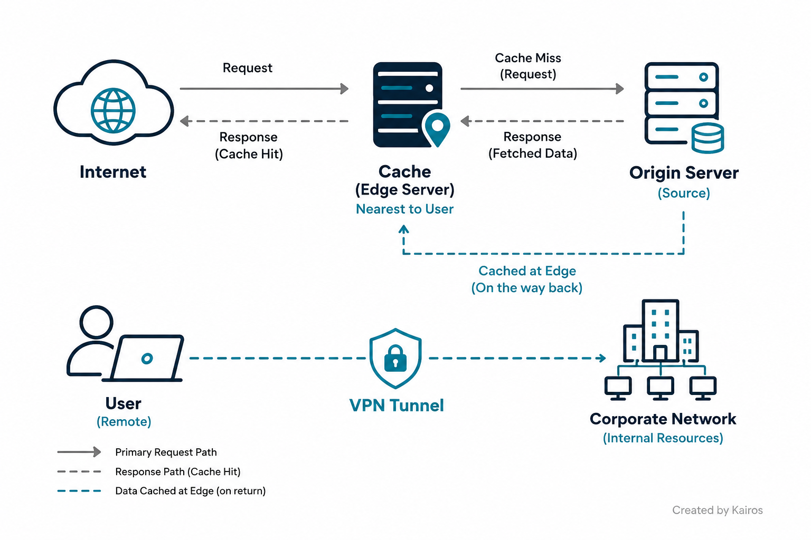
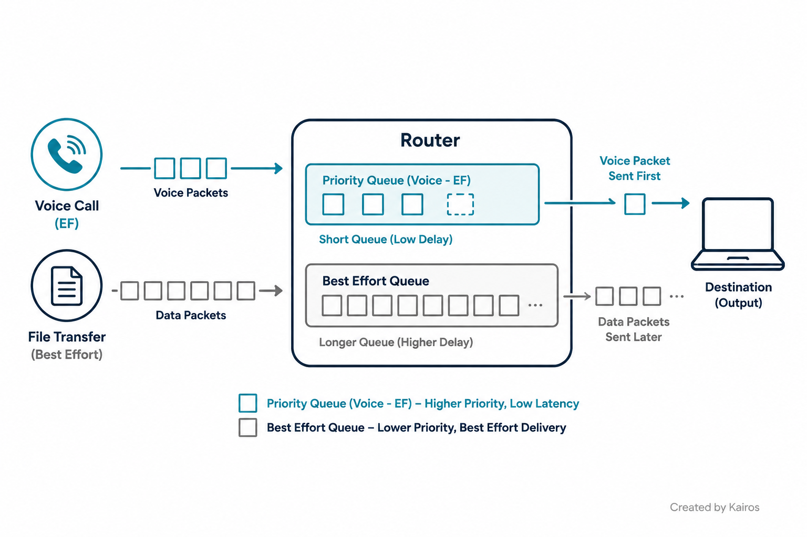
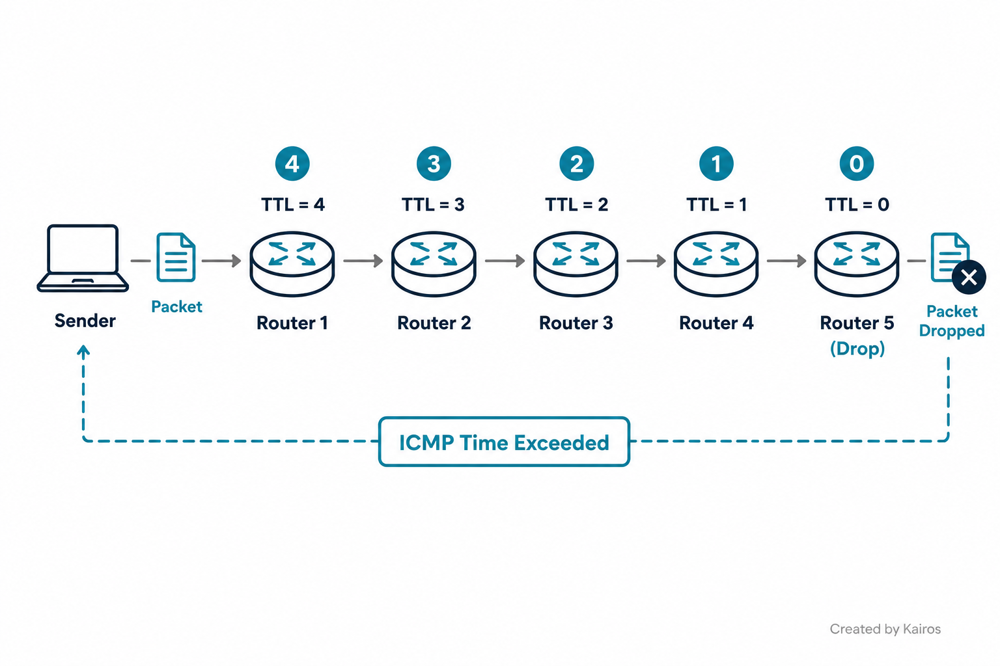

# Networking Functions
*CDN, VPN, QoS, and TTL — the functions that make data move fast, stay private, get prioritized, and don't live forever*

## In short
These aren't devices, they're **functions/applications** layered on top of the infrastructure — CompTIA splits 1.2 into "physical/virtual appliances" (router, switch, firewall...) and then "applications" (CDN) + "functions" (VPN, QoS, TTL). This note covers the second half. Most interview questions here aren't "what does X do" — they're "what's actually happening under the hood when X runs," which is exactly where I kept losing points.

## What it is
Every one of these solves a different problem on the same underlying network: CDN solves *distance/speed*, VPN solves *privacy over a public network*, QoS solves *who gets priority when the link is congested*, and TTL solves *what stops a packet from looping forever*. They look independent but actually stack on top of each other — a VPN tunnel can hide the very marking QoS depends on, for example.

## Quick reference

| Function | What it does | Core mechanism |
|---|---|---|
| CDN | Speeds up content delivery | Distributed edge caching + origin pull on a miss |
| VPN | Private tunnel over a public network | Encryption (confidentiality) + HMAC (integrity) |
| QoS | Prioritizes traffic under congestion | DSCP marking + queuing/scheduling |
| TTL (IP) | Stops a packet from looping forever | Hop counter, decremented per router, drop + ICMP at 0 |
| TTL (DNS) | Same name, different job | Seconds-based cache expiry for DNS records |

## Why it matters
This is the "why does the call sound choppy / why is this page slow / why did traceroute show that" layer — the actual troubleshooting questions.

→ Video call breaking up while someone's downloading a big file on the same link? That's a **QoS** problem (or the total lack of QoS) — with no config, everything is best-effort FIFO, and UDP voice traffic has no way to back off like TCP does.

→ A site loads instantly for one user and slowly for another on the other side of the world? Check whether **CDN** is even caching that content at their nearest edge, or if every request is going all the way to origin.

→ VPN is "on" but call quality is bad over it, even though QoS looks configured correctly? Classic gotcha — the DSCP marking might be on the inner header only, invisible to routers that just see the encrypted outer tunnel header.

→ A `traceroute` reply shows an odd TTL number like 51? Don't read it as "the OS has TTL 51" — that's what's *left* after hops, not a starting value. Compare against the nearest standard default (64/128/255) above it to estimate hop count.

## How it works

### Content Delivery Network (CDN) — an application, not just caching
Traditional delivery means every request travels all the way back to one origin server, no matter where the user is — that's slow at distance. A CDN fixes this with **geographically distributed edge servers** that hold copies of the content close to the user.

→ **Cache hit**: request hits the nearest edge node, content's already there, served immediately.

→ **Cache miss**: the edge checks a mid-tier/regional cache if one exists, and if still a miss, goes all the way to the **origin server**. The origin serves it, and the edge node **stores a copy on the way back** — so the next user gets a hit. This self-healing "origin pull" pattern is why CDNs handle sudden traffic spikes well.

→ Caching is the visible part, but a CDN is also doing **DDoS mitigation** (edge nodes absorb attack volume before it reaches origin), **SSL/TLS termination** (offloads encryption from origin), **load balancing** across edge nodes, and **origin shielding** (most requests never even reach the real backend). "It's just caching" undersells it.

### Virtual Private Network (VPN)
A secure, private tunnel between two devices (or two networks) across a public, untrusted medium like the internet.

→ **Confidentiality**: the payload gets **encrypted**, so anyone intercepting it in transit can't read it.

→ **Integrity**: encryption alone doesn't prove the data wasn't tampered with. That's a separate job done by **HMAC (Hash-based Message Authentication Code)** — sender and receiver both hash the packet using a shared key; if a bit gets changed in transit, the hashes won't match. In IPsec, this is why there are two pieces: **AH** (integrity/auth only) and **ESP** (encryption + integrity, the one most VPNs actually use).

→ **Concentrator / headend**: the device that terminates the tunnel and does the encrypt/decrypt work. Can be a dedicated appliance, integrated into a firewall, or fully software/virtual — it's not tied to hardware specifically, that's just one deployment option among others.

→ **Site-to-site VPN**: connects two *networks* (gateway-to-gateway), always-on, transparent to end users — no client software needed. Common with IPsec tunnel mode.

→ **Remote-access (client) VPN**: a single *user's device* runs client software (AnyConnect, GlobalProtect, etc.) and tunnels out to the concentrator sitting at the corporate edge. The concentrator is always on the org's side in both cases — what differs is what's on the *other* end of the tunnel: another gateway, or one client device.

### Quality of Service (QoS)
Manages traffic priority when a link is congested — configurable on routers, switches, or firewalls.

→ With **no QoS configured**, traffic defaults to **best-effort delivery** through a single **FIFO queue** — first come, first served, no exceptions. When that queue fills up, the router does **tail drop**: it just discards whatever new packets arrive.

→ TCP notices drops and backs off (congestion control). **UDP doesn't** — voice/video keep transmitting at the same rate regardless, so the user experiences it as jitter or choppy audio. This is *why* QoS specifically matters for real-time traffic.

→ **How prioritization actually works**: packets get classified and marked — usually with a **DSCP (Differentiated Services Code Point)** value in the IP header (voice often gets **EF – Expedited Forwarding**). The router/switch then sorts marked traffic into separate **queues** and a scheduler services the high-priority queue first/more often. Two related enforcement tools: **shaping** (buffers/delays excess traffic to smooth it to a target rate) and **policing** (drops or re-marks traffic over the limit, no buffering).

→ **Gotcha with VPN**: when a packet gets tunneled, its original (inner) header — including any DSCP marking — gets wrapped inside a new outer header. If a router only reads the outer header, the priority marking is invisible. Most VPN implementations copy the DSCP value to the outer header specifically to prevent this; if that copy doesn't happen, QoS silently stops working across the tunnel even though it's "configured right."

### Time To Live (TTL) — IP header, hop-based
Not a measure of time or delivery speed — it's a **hop counter** that prevents a packet from circulating forever.

→ Every router that forwards a packet **decrements the TTL by 1**. When a router receives a packet with TTL=1, it decrements to 0 and **drops it there** — it never forwards a TTL=0 packet onward.

→ On drop, the router sends an **ICMP "Time Exceeded"** message back to the original source. This reply is exactly how `traceroute`/`tracert` works: send packets with TTL=1, 2, 3... and map the path from the "time exceeded" replies at each hop.

→ **Default starting values**: 64 for Linux/macOS, 128 for Windows (some network gear defaults to 255). If a reply arrives with an unusual value like 51, that's a leftover after decrements — compare it against the nearest standard default *above* it (64) to estimate hop count (64 − 51 = 13 hops here), but treat it as an educated guess based on common defaults, not a certainty, since you can't know the true starting value for sure.

### Routing loops — the reason TTL exists
→ Router A thinks the next hop is Router B, and Router B thinks the next hop is Router A — the packet bounces back and forth. Easy to cause with a static routing misconfiguration.

→ Without TTL, this would be genuinely catastrophic: packets loop forever, endlessly consuming bandwidth, degrading the network toward congestion collapse.

→ TTL caps the damage **per packet** — each bounce decrements the TTL, so a looping packet dies after at most 64/128 hops. It doesn't fix the loop or stop new packets from entering it — it just guarantees no single packet lives forever while the actual misconfiguration gets fixed.

### DNS TTL — same name, different mechanism entirely
→ DNS resolves a domain name to an IP address (`dns.google` → `8.8.8.8`), and a resolver **caches** that answer for a while so it doesn't have to re-query every time.

→ The "TTL" here is a value in **seconds** attached to the DNS record — wall-clock cache expiry — not a hop counter. Same word as IP TTL, completely different unit and completely different enforcement point (a hop counter on a router vs. a countdown timer on a resolver's cache).

## Key details to remember
- CDN = distributed edge caching + origin pull on miss; also does DDoS mitigation, SSL termination, load balancing, origin shielding — not "just caching."
- VPN = encryption (confidentiality) + HMAC (integrity), two separate jobs. IPsec: AH = integrity only, ESP = encryption + integrity.
- Concentrator/headend can be hardware, software, or integrated into a firewall — not hardware-only.
- Site-to-site VPN = network-to-network, always-on, no client needed. Remote-access VPN = client software on the user's device tunnels to the concentrator at the org edge.
- No QoS = best-effort, single FIFO queue, tail drop when full. TCP backs off on drops, UDP doesn't — why voice/video need QoS specifically.
- QoS mechanism = classify → mark (DSCP, e.g. EF for voice) → queue → schedule. Shaping buffers excess traffic; policing drops/re-marks it.
- VPN tunneling can hide DSCP marks (inner header vs. outer header) — VPNs should copy DSCP to the outer header or QoS silently breaks across the tunnel.
- IP TTL = hop counter, decremented once per router. At 0, the router drops the packet and sends ICMP Time Exceeded — this is how traceroute works.
- Default TTLs: 64 (Linux/macOS), 128 (Windows), 255 (some network gear). A received value is a guess about hop count based on the nearest default above it, not a certainty.
- Routing loops are only survivable *because* of TTL — without it, a loop would cause unbounded congestion, not just temporary congestion.
- DNS TTL ≠ IP TTL. DNS TTL is a cache-expiry countdown in seconds; IP TTL is a hop counter. Same name, unrelated mechanisms.

## Where I got confused
- Defined TTL as "the time taken to make the data available" in one spot and "number of hops before drop" in another — contradicted myself. TTL is the hop counter; latency/delivery time is a completely different concept.
- Put DNS TTL under the same definition as IP TTL without noticing they're different mechanisms — one's a hop count, the other's a countdown in seconds. Same name doesn't mean same thing.
- Said the VPN concentrator provides encryption "at the hardware level," then separately said deployment could be hardware or software — direct contradiction. Concentrator function isn't tied to hardware.
- Called CDN "just caching" when pushed to go deeper — missed DDoS mitigation, SSL termination, load balancing, and origin shielding entirely.
- Described remote-access VPN backwards — said the user installs "a VPN server or physical device," when actually the user installs client *software* and connects out to the concentrator, which sits on the org's side.
- Had no idea how QoS actually enforces priority — didn't know about DSCP marking or queuing/scheduling at all before this came up.
- Called the VPN integrity mechanism a "secret verification key" — the actual term is HMAC (hash-based, using a shared key), not just "a key."
- Did the TTL hop-count math wrong (said 64 − 51 = 14, it's 13), and didn't flag that the starting TTL itself is an assumption based on common defaults, not something you can know for certain.
- Explained why a routing loop is bad ("it overloads the network") but not why it *doesn't stay bad forever* — missed that TTL is the specific reason a loop is self-limiting per packet.
- Listed CDN, VPN, QoS, and TTL as four separate things without realizing they can interact — missed that VPN encapsulation can hide the DSCP marking QoS depends on, breaking prioritization across a tunnel even when both are "configured correctly."

## How I'd say this out loud
CDN, VPN, QoS, and TTL all solve different problems on top of the same network. A CDN caches your content on edge servers around the world so users hit something nearby instead of one far-away origin — and when it's not cached, it falls back to the origin and caches it for next time, plus it's doing DDoS protection and SSL termination along the way, not just caching. A VPN gives you a private tunnel over the public internet — encryption keeps it confidential, and a separate hash-based check (HMAC) makes sure nobody tampered with it in transit. QoS decides who gets priority when the link is busy — traffic gets marked with a DSCP value and sorted into queues, so voice doesn't get starved by a big download, though a VPN tunnel can accidentally hide that marking if it's not copied to the outer header. And TTL is just a hop counter in the IP header — every router knocks it down by one, and at zero the packet gets dropped and the sender gets an ICMP message back, which is literally how traceroute works. That same counter is the only reason a routing loop doesn't run forever and kill the network — it caps how long any one packet can bounce around before it's forced to die. DNS has its own "TTL" too, but that one's just seconds until a cached record expires — same word, nothing to do with hop counts.
