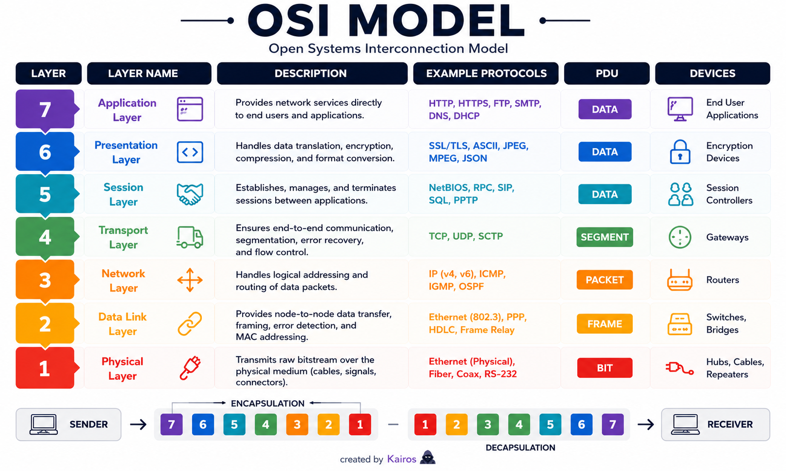

# OSI Model
*Open Systems Interconnection*

## In short
A reference model that breaks down how data moves across a network into 7 layers, from the physical cable all the way up to the actual application.

## What it is
7 layers total. Numbering starts from the bottom — physical layer is layer 1, application layer is layer 7, not the other way around.

## Quick reference

| # | Layer | Handles |
|---|---|---|
| 7 | Application | Interface the user actually interacts with — HTTP, HTTPS |
| 6 | Presentation | Format translation, compression, encryption |
| 5 | Session | Starting, maintaining, ending sessions |
| 4 | Transport | TCP/UDP — hands data down to the network layer |
| 3 | Network | IP addressing, routing across networks, packets |
| 2 | Data Link | MAC addressing, framing, CRC error-checking |
| 1 | Physical | Cables, signals, connectors — raw transmission |

## How it works

---

### Layer 1 — Physical
This is the layer where the actual physical transmission happens — data moves through cables as **electrical signals**, or as **light** in fiber optic cables. It also covers the physical stuff itself: cable connectors, network cards, and so on.

---

### Layer 2 — Data Link
Mainly responsible for reliable data transfer between devices on the same local network, **MAC addressing**, and controlling who gets to send data and when.

→ It takes data from the network layer and **frames** it — the frame has the data itself, a header, and an error-checking value (**CRC**) that helps detect if a frame got corrupted or lost along the way, and checks whether it actually reached the correct destination.

→ **MAC (Media Access Control) address** is the address of the physical device itself — like a network card — used to identify the correct device on the local network.

---

### Layer 3 — Network
Mainly handles **IP addressing**, routing data between different networks through routers, and subnet masking.

→ It takes data from the transport layer and wraps it into **packets**, adding source and destination IP addresses, so it can be routed to a different network — not just the local one, that part is the data link layer's job.

---

### Layer 4 — Transport
Sits between the session layer above it and the network layer below it — hands data down toward the network layer, and reassembles it on the way back up.

→ Uses **TCP** (Transmission Control Protocol) and **UDP** (User Datagram Protocol) for transmission of data.

---

### Layer 5 — Session
Responsible for managing sessions — starting, maintaining, and ending a session between two devices.

→ Before any data transfer happens, a session needs to be established first.

---

### Layer 6 — Presentation
Mainly responsible for translating data into a format the application layer can actually understand. Format conversion and **compression** happen here too.

→ **Encryption** also happens at this layer, and it primarily works with the application layer.

---

### Layer 7 — Application
This is the interface layer the user actually interacts with. Includes protocols like **HTTP** and **HTTPS**.

---

## Key details to remember
- 7 layers total, numbered bottom to top: Physical(1) → Data Link(2) → Network(3) → Transport(4) → Session(5) → Presentation(6) → Application(7)
- Data Link = frames, uses MAC address + CRC
- Network = packets, uses IP address
- Transport = TCP (reliable) / UDP (fast, no guarantee)
- Full name: Open Systems Interconnection