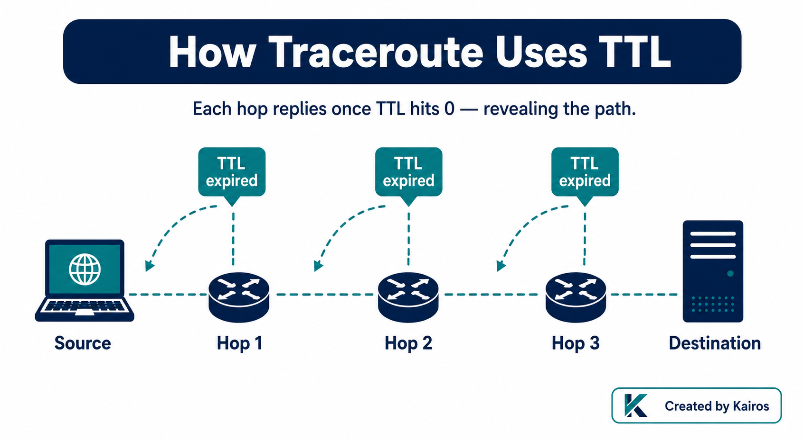
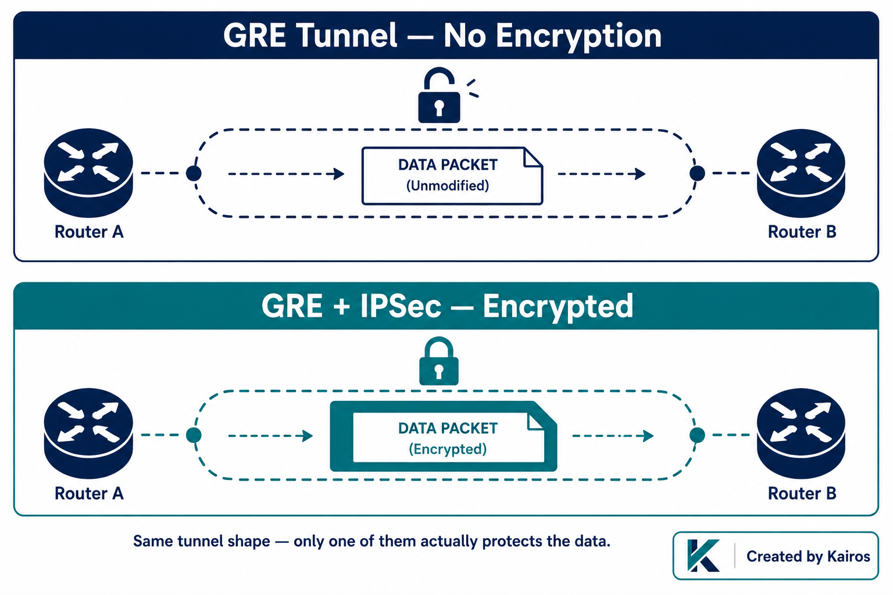
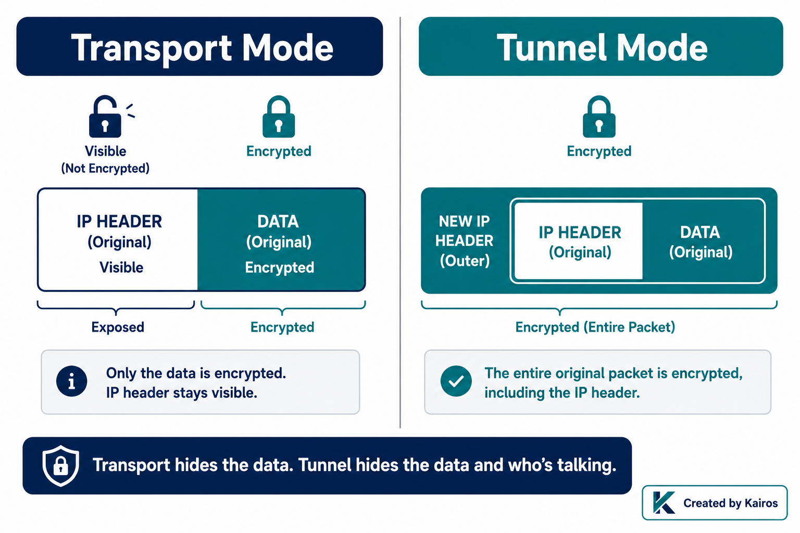

# Other Useful Protocols (ICMP, GRE, IPSec) — N10-009 1.4

## In short
ICMP is how you check if a device is online. GRE builds a tunnel between two points, but it doesn't lock anything — no encryption. IPSec is what actually secures that tunnel. It has two flavors — AH (checks the data wasn't tampered with, but doesn't hide it) and ESP (hides the data *and* checks it) — set up in two steps (Phase 1 builds a safe channel to talk in, Phase 2 agrees on how the real traffic gets protected), and it can run in transport mode (hides the data, but not who's talking to whom) or tunnel mode (hides everything).

## What it is
- **ICMP**: not TCP, not UDP — its own thing, riding directly on IP. Used to check if something's alive (ping) or tell you why a packet didn't make it (unreachable, TTL expired).
- **GRE**: wraps one packet inside another so it can travel through a tunnel. Just transport — no protection built in.
- **IPSec**: the standard way to encrypt VPN traffic. Works across different brands of firewall/router because everyone follows the same rulebook.
  - **AH** (Authentication Header): proves the data wasn't tampered with and who sent it — but sends it in plain view.
  - **ESP** (Encapsulating Security Payload): does what AH does *plus* actually hides the data.
  - **IKE**: the handshake that happens before any real data flows. Two steps, ends with both sides agreeing on a shared secret (called a Security Association).

## Why it matters
This isn't just something to memorize for the exam — it's the kind of thing that shows up when you're looking at a network design and asking "is this actually safe, or does it just look safe?"

- **ICMP isn't harmless.** Attackers use it to find live hosts, fingerprint what OS a machine is running, and sometimes even sneak stolen data out disguised as ping traffic. If ICMP is wide open between network zones that don't need to talk, that's worth a second look.
- **GRE tunnel ≠ VPN.** Seeing "GRE tunnel" on a diagram with nothing else is a red flag — GRE moves data through a tunnel, it doesn't protect it. Without IPSec added on top, everything inside is sitting in plain text.
- **AH vs ESP is the real question whenever someone says "we use IPSec."** AH alone means anyone listening in can still read the data — they just can't quietly change it without you knowing. Almost everyone actually wants ESP.
- **Transport mode still leaks something.** Even with ESP encrypting the data itself, transport mode leaves the original sender/receiver IP addresses visible. That's enough for an attacker to map out who's talking to whom inside your network. Tunnel mode hides that too — which is why it's the default for real site-to-site VPNs.

## How it works

**ICMP (ping / traceroute):**
- Ping sends a request, waits for a reply, tells you if the device is alive.
- Every packet carries a TTL (time to live) that drops by 1 at each router hop. Hit zero, and that router drops the packet and sends back "time exceeded."
- Traceroute uses this on purpose — it sends packets with TTL 1, then 2, then 3, and so on, so each hop along the way replies and reveals itself. That's how you see the whole path.

**GRE:**

- Takes the original packet, wraps it inside a new one, sends it through the tunnel, unwraps it on the other end.
- No encryption at all by itself — you need IPSec on top of it for a real secure connection between two sites.

**IPSec — Phase 1 (called ISAKMP):**
- Happens over UDP port 500.
- Uses Diffie-Hellman to create a shared secret between both sides.
- Goal: prove both sides are who they say they are, and build a safe channel to negotiate the real deal in. No actual data is protected yet.

**IPSec — Phase 2:**
- Now both sides agree on the real settings: which encryption to use, key sizes, and exactly which traffic is allowed through.
- Builds the actual ESP tunnel that will carry real traffic.
- **Important:** Phase 1 succeeding only proves both sides trust each other — it says nothing about whether Phase 2's separate settings will match. They're negotiated independently, so one can succeed while the other fails. In practice, the most common Phase 2 failure is a mismatch in which subnets/traffic are supposed to go through the tunnel.

**Transport mode:**

- Adds an IPSec header, but keeps the original IP header visible.
- The data itself gets encrypted (if using ESP), but source and destination IPs are still readable by anyone capturing the traffic.

**Tunnel mode:**
- Encrypts the original IP header *and* the data.
- Wraps everything in a brand new IP header that only shows the two VPN endpoints — not the real source and destination.
- This is what almost every real site-to-site VPN uses, because it hides your internal network layout from anyone watching the wire.

## Key details
- ICMP: its own protocol, not TCP/UDP.
- GRE without IPSec = plaintext, no matter how "VPN-like" it looks on a diagram.
- VPN concentrator: the device (often built into a firewall) doing the actual encrypting/decrypting.
- Phase 1 = ISAKMP = UDP port 500 = Diffie-Hellman.
- AH = proves integrity + who sent it, but no privacy.
- ESP = integrity + who sent it + privacy (this is what most people actually use).
- Transport mode: data is hidden, but the original IP addresses are not.
- Tunnel mode: everything is hidden, including the original IP addresses.

## Where I got confused
- Said transport mode sends data in plain text — not correct. ESP still encrypts the data in transport mode. What's exposed is the original IP addresses, not the content itself.
- First instinct for finding where a packet is dying (TTL expired) was to check the route table — that only shows the next hop from my own device, not the full path. Traceroute is the right tool, and it works by exploiting this exact TTL behavior.
- My GRE answer was right in substance but I led with a question instead of stating the risk first — better to say "this could be unencrypted" up front, then ask if IPSec is layered on top.

## How I'd say this out loud
"ICMP is basically ping — it tells you if something's alive, and the 'TTL expired' message is exactly what traceroute uses to map out the path hop by hop. GRE just builds a tunnel — it doesn't lock the door, you still need IPSec for that. IPSec itself has two setup steps: Phase 1 builds a safe channel to talk in, Phase 2 decides how the real data gets protected — and either one can fail on its own. AH proves the data's legit but doesn't hide it, ESP does both, so the real question is always 'AH or ESP?' And even with ESP, transport mode still shows your real IP addresses to anyone watching — tunnel mode is what actually hides that too."
