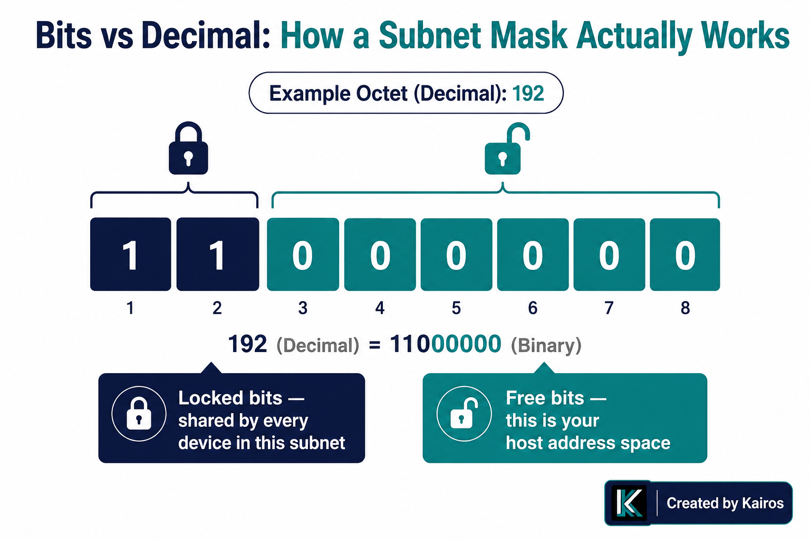
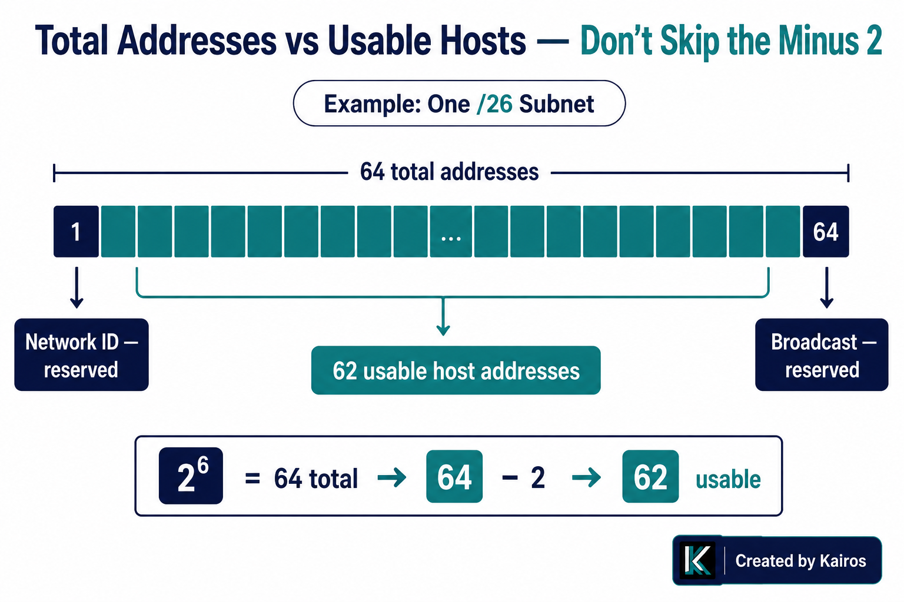
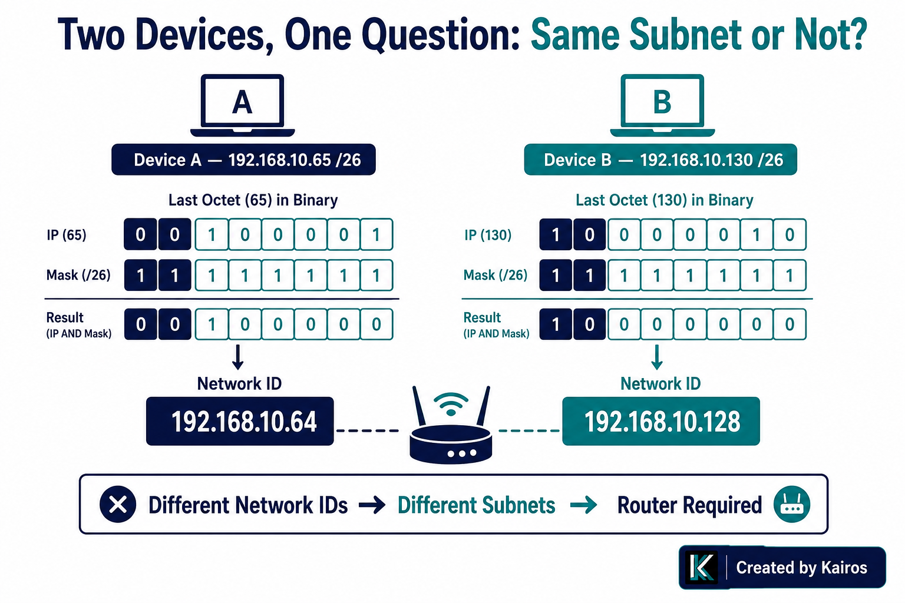

# Subnetting Basics

## In short
A subnet mask tells you how much of an IP address is "network" and how much is "host." Everything comes from one move: count the 1-bits in the mask, that's your `/N`. Free bits (32 − N) decide how many addresses you get, and you always lose 2 of them (network ID + broadcast) to get usable hosts.

## What it is
- **Subnet mask**: a 32-bit value, same shape as an IP address, that marks which bits are "locked" (network) and which are "free" (host).
- **CIDR notation (`/N`)**: shorthand for the mask — N is just the count of 1-bits. `/24` = 24 ones then 8 zeros = `255.255.255.0`.
- **Network ID**: the address you get after zeroing out every free bit. Identifies the subnet itself, not any device on it.
- **Broadcast address**: the address you get after setting every free bit to 1. Reserved for "send to everyone on this subnet."
- **Usable host range**: everything between the network ID and broadcast address, exclusive of both.

## Why it matters
This is the thing that turns "same first two octets" pattern-matching into an actual skill:
- Two devices with the *same mask* are not automatically on the *same subnet*. You have to apply the mask to both IPs and compare the resulting network ID — "same mask" alone tells you nothing about whether the devices match.
- Reading decimal octets without converting to binary is how you misclassify addresses. `172.20.x.x` and `172.32.x.x` look almost identical in decimal but land on opposite sides of the 172.16.0.0/12 private range — the difference only shows up once you check the actual bit pattern.
- "Total addresses" and "usable hosts" are two different numbers. Interview and exam questions ask for usable hosts specifically, and forgetting to subtract 2 is the single most common way to get the right method but the wrong final answer.
- This is also the exact mechanism behind subnetting a network into smaller pieces — borrowing bits from the host portion to create more, smaller subnets, which is the practical reason any of this matters beyond trivia.

## How it works


**Step 1 — mask to binary, count the 1s.**
Don't eyeball the decimal number. Convert it and count.
```
255.255.255.192
= 11111111.11111111.11111111.11000000
= 24 + 2 = /26
```

**Step 2 — free bits tell you block size.**
```
32 − 26 = 6 free bits
2^6 = 64 total addresses in the block
64 − 2 (network + broadcast) = 62 usable hosts
```


**Step 3 — network ID = AND the IP against the mask.**
Locked bits carry through unchanged. Free bits get zeroed — you don't just copy the original IP.
```
IP:    192.168.10.130  →  ...10  10000010
Mask:  255.255.255.192 →  ...11  11000000
AND:                       ...10  10000000  =  192.168.10.128
```

**Step 4 — real example, worked start to finish.**


Device A: `192.168.10.65` /26
Device B: `192.168.10.130` /26
Same mask — but are they on the *same* subnet? Apply the mask to both:
- `65` = `01000001` → AND with `11000000` → `01000000` = `64` → network ID `192.168.10.64`
- `130` = `10000010` → AND with `11000000` → `10000000` = `128` → network ID `192.168.10.128`

Different network IDs → different subnets → these two devices need a router between them, even though they share the exact same mask and could be plugged into the same physical switch.

**Step 5 — how many subnets does borrowing bits get you.**
Going from a /24 to a /26 "borrows" 2 bits (26 − 24) from the host portion into the network portion. Each borrowed bit doubles the subnet count:
```
2^2 = 4 subnets, each with 62 usable hosts
```

## Key details
- Count 1-bits in binary → that's your `/N`. Never pattern-match decimal numbers against masks you've memorized.
- Network ID: AND the IP with the mask. Free bits → 0. Not a copy of the original IP.
- Broadcast address: same idea, but free bits → 1 instead of 0.
- Usable hosts = 2^(free bits) − 2. The "− 2" is not optional and is the single most-forgotten step.
- Subnets gained from borrowing = 2^(borrowed bits), where borrowed bits = new prefix − old prefix.
- Same subnet mask ≠ same subnet. You must compute and compare network IDs, every time, even when the masks match.
- A /12 isn't "172.16 through 172.31" as memorized decimal boundaries — it's 8 fully-locked bits (first octet) + 4 locked bits of the second octet, leaving 4 free bits (2^4 = 16 possible second-octet values, 16 through 31).

## Where I got confused
- On a /10 mask (`255.192.0.0`), I converted the binary correctly but miscounted the 1-bits and called it a /16 instead of /10 — I was pattern-matching "192 in the second octet" against masks I'd seen before instead of actually counting.
- Repeatedly stopped at "total addresses in the block" (2^free bits) and reported that as "usable hosts," skipping the − 2 for network ID and broadcast. Had to be corrected on this twice before it became automatic.
- On the network ID for a /28, I copied the original IP's last octet forward unchanged instead of zeroing the free bits — forgot that free bits need to become 0, not stay whatever they were in the source IP.
- Called "same subnet mask" sufficient proof that two devices could talk directly, without actually computing and comparing the network ID for each device.
- Said "leftmost 4 digits" instead of "leftmost 4 bits" when describing which part of an octet is locked — decimal-digit thinking instead of binary-bit thinking, which is the root cause of most of the above mistakes.

## How I'd say this out loud
"A subnet mask just tells you how many bits from the left are locked — count the 1s in binary, that's your `/N`. Whatever's left over is free, and 2 to the power of those free bits is your block size. To get the network ID, you AND the IP against the mask — locked bits stay, free bits go to zero. Usable hosts is that same block size minus 2, because you always lose the network address and the broadcast address. And the thing people skip: same mask doesn't mean same subnet — you have to actually compute the network ID for both devices and check they match, every single time."